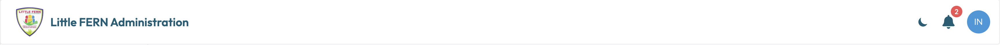
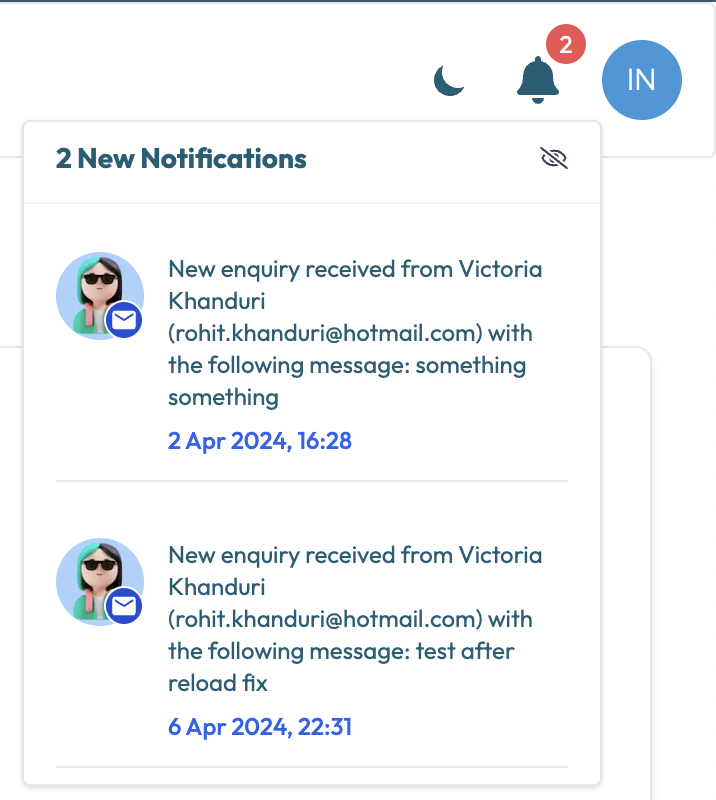

# Basics
This web app is designed to help you manage the data of the [Little Fern](https://www.littlefern.in/) website.
You can update the website's content and view analytics.
For questions or issues, please contact [👨🏽Rohit](mailto:rohit.khanduri@proton.me)

## Getting Started

Admin user details:
- Username: info@littlefern.in
- Password: _your password_

**NOTE**: The web app is designed only for laptops and desktops. It is not optimized for mobile devices.

# Login

  
  ➡️
  

# Header

The header is the top part of the webapp. It contains the logo, a notification bell, a color scheme toggle, and a user profile icon. The header is
always visible on the website.
- Logo: Clicking on the logo will redirect you to the home page.
- Notification Bell: The notification bell will show a badge with the number of unread notifications. Clicking on the bell will open a dropdown with the list of notifications.
- Color Scheme Toggle: The color scheme toggle is used to switch between light and dark mode.
- User Profile Icon: The user profile icon will show the user's profile picture. Clicking on the icon will open a dropdown with the user's profile
  details and options to log out and other useful links.

**Unauthorized User**: The header will contain a message if the logged-in user is authorized to update the website.

By clicking on the "Login as a different user" button, you will be logged out of the current user and redirected to the login page where you can log in as a different user.

## Notifications

  
  

The notifications bell will show a badge with the number of unread notifications. Clicking on the bell will open a dropdown with the list of notifications.
If there are no unread notifications, the badge will not be visible, and the dropdown will show a message "No new notifications".

The notifications dropdown will show a list of notifications. Each notification will have a title, description, and a timestamp. Clicking on a
notification will mark it as read and redirect you to your email inbox.

**NOTE**: There is a "Mark all as read" button in the top right corner of the dropdown. Clicking on this button will mark all notifications as
read and the badge on the notification bell will disappear with a message "No new notifications" in the dropdown.

## User Menu

The user menu dropdown will show the user's name, email, and the following options:
- [Dashboard](pages/dashboard.md): Redirects to the user's dashboard.
- Inbox: Redirects to the user's email inbox.
- Newsletters: Redirects to the Substack newsletters page.
- [Settings](pages/settings.md) Settings: Opens the user settings page.
- Sign out: Logs out the user and redirects to the login page.

# Sidebar

  
  
    The sidebar is the left part of the webapp. It contains the following sections:
    <ul>
      <li><a href="#/pages/dashboard.md">Dashboard</a> - Redirects to the user's dashboard.</li>
      <li>Pages - Contains a list of pages on the website. Clicking on a page will open the page editor.</li>
      <ul>
        <li><a href="#/pages/home.md">Home</a> - Redirects to the home page editor.</li>
        <li><a href="#/pages/about.md">About</a> - Redirects to the about page editor.</li>
        <li><a href="#/pages/programs.md">Programs</a> - Redirects to the programs page editor.</li>
        <li><a href="#/pages/contact.md">Contact</a> - Redirects to the contact page editor.</li>
        <li><a href="#/pages/parents.md">Parents</a> - Redirects to the parents page editor.</li>
          <li><a href="#/pages/gallery.md">Gallery</a> - Redirects to the gallery page editor.</li>
      </ul>
      <li><a href="#/pages/add.staff.md">Add Staff</a> - Opens the add staff form.</li>
      <li><a href="#/pages/remove.staff.md">Remove Staff</a> - Opens the remove staff form.</li>
      <li><a href="#/pages/remove.program.md">Remove Program</a> - Opens the remove program form.</li>
      <li><a href="#">Documentation</a> - Redirects to the documentation page.</li>
      <li><a href="#/pages/partykit.md">PartyKit Server</a> - Redirects to the PartyKit server page.</li>
    </ul>
  

