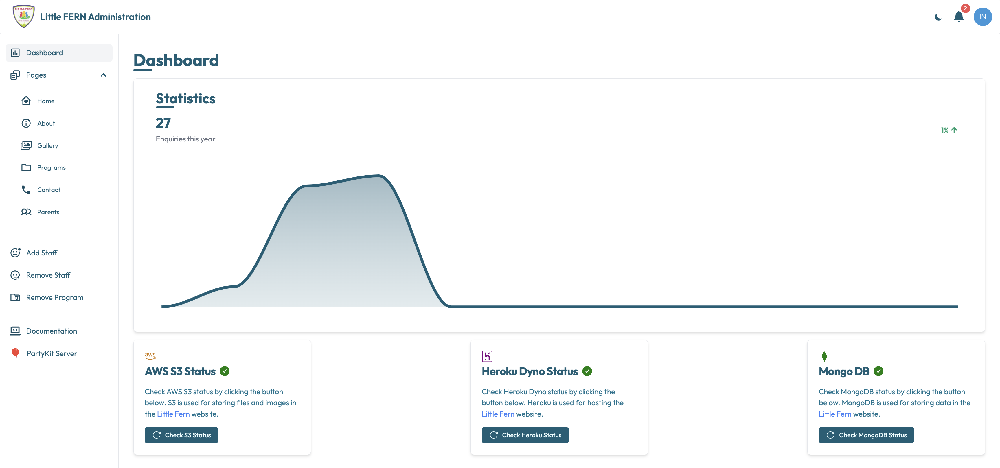

# Dashboard
The dashboard is the analytics page of the webapp and is designed to help you monitor the website's performance and the status of the servers and 
databases where the website is hosted.

It contains the following sections:
- Statistics: Shows a graph of the number of users per month who contacted the website.
- AWS S3 Status: Shows the status of the AWS S3 bucket where the website assets are stored.
- Heroku Status: Shows the status of the Heroku server where the website is hosted.
- MongoDB Status: Shows the status of the MongoDB database where the website data is stored.

**NOTE**: Do not drive yourself crazy with the details of the content. 
The page has been created to give you an idea of the availability of the servers and the performance of the website.

## Statistics
**NOTE**: This graph will only show if there are any enquiries in the database which means that users have contacted through the website.

The statistics graph shows the number of users who contacted the website per month. The graph is updated in real-time and shows the data for the last 12 months.
In the top left corner of the graph, there is a count of the number of Enquiries received this year and in the top right corner, there is a 
percentage increase or decrease in the number of Enquiries compared to the previous month.

### The Graph
The graph shows the number of users who contacted the website per month. The x-axis represents the months, and the y-axis represents the number of users.
If you hover over a point on the graph, a tooltip will show the number of users who contacted the website in that month and the month name.

## AWS S3 Status
The AWS S3 Status section shows the status of the AWS S3 bucket where the website assets are stored. The status can be one of the following:
- **✅**: The AWS S3 bucket is healthy and all assets are accessible.
- **❌**: The AWS S3 bucket is experiencing some issues and some assets may not be accessible.

## Heroku Status
The Heroku Status section shows the status of the Heroku server where the website is hosted. The status can be one of the following:
- **✅**: The Heroku server is healthy and the website is accessible.
- **❌**: The Heroku server is experiencing some issues and the website may not be accessible.

## MongoDB Status
The MongoDB Status section shows the status of the MongoDB database where the website data is stored. The status can be one of the following:
- **✅**: The MongoDB database is healthy and all data is accessible.
- **❌**: The MongoDB database is experiencing some issues and some data may not be accessible.

# Troubleshooting
- If the AWS S3 Status is ❌, click on the **Check S3 Status** button to check the status of the AWS S3 bucket. If the status is still ❌, contact [👨🏽Rohit](mailto:rohit.khanduri@proton.me)
- If the Heroku Status is ❌, click on the **Check Heroku Status** button to check the status of the Heroku server. If the status is still ❌, 
  contact [👨🏽Rohit](mailto:rohit.khanduri@proton.me)
- If the MongoDB Status is ❌, click on the **Check MongoDB Status** button to check the status of the MongoDB database. If the status is still ❌, 
  contact [👨🏽Rohit](mailto:rohit.khanduri@proton.me)

**NOTE**: Do not keep clicking on the buttons if the status is ❌. The buttons are there to help you check the status of the servers and databases.