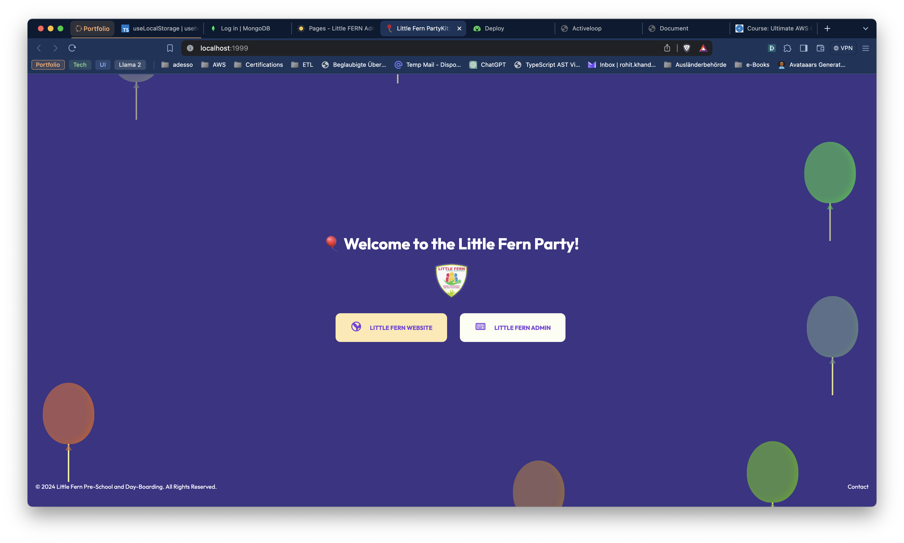

# PartyKit Server
This is basically a web socket which listens for incoming connections and sends them to the appropriate party. 
On viewing the page by clicking onto the link, you will see a page which offers two links to either-
- Go to the Website
- Go to the Admin Panel

NOTE: This is not relevant for the end user.

Looks fantastic, doesn't it?

