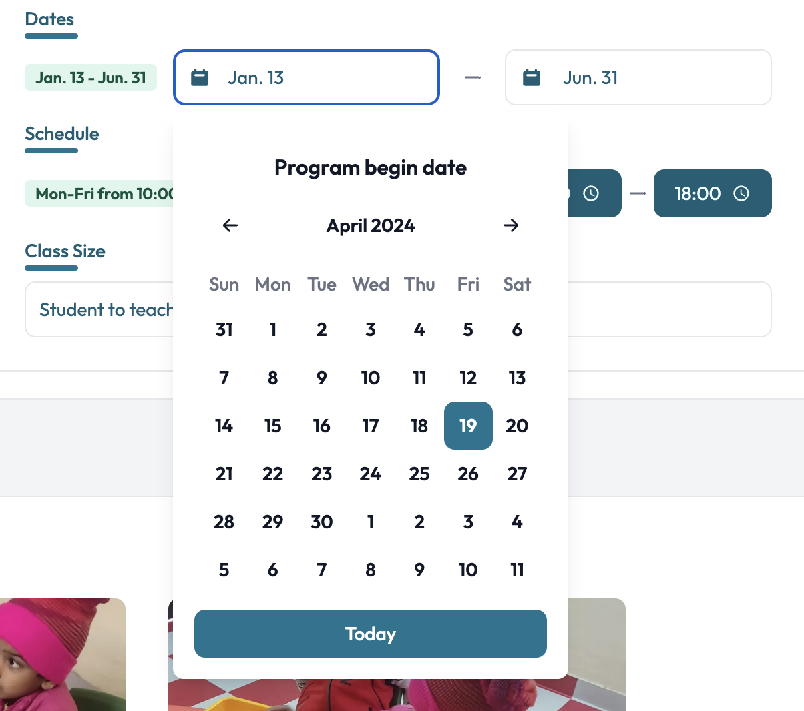
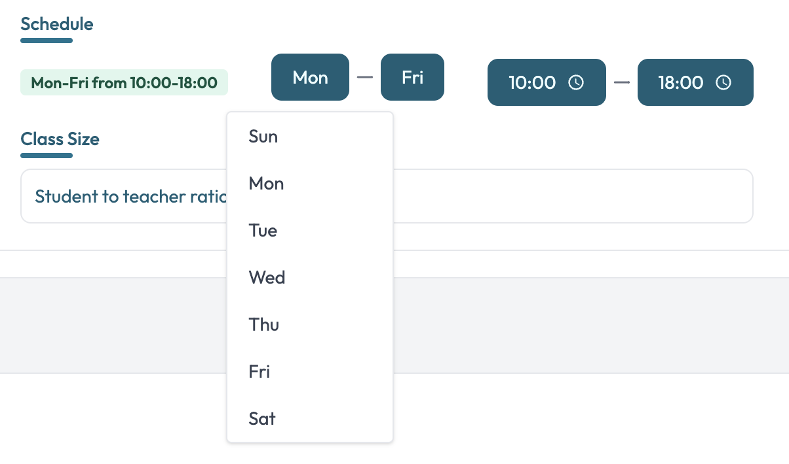
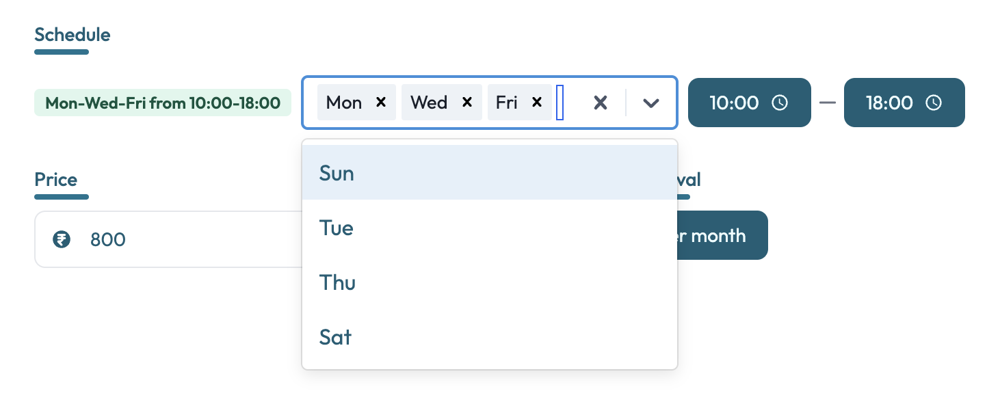
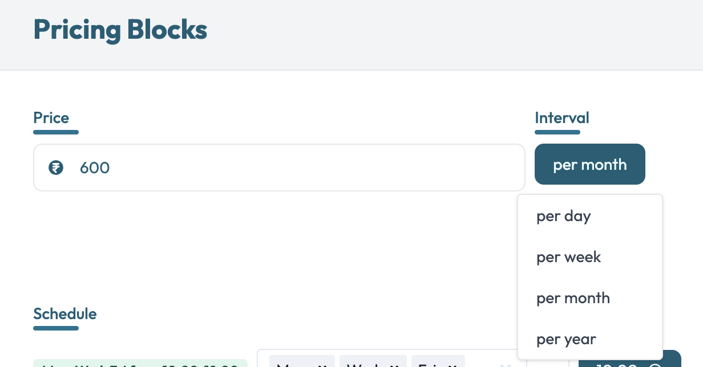

# Programs
The programs are the main part of the website.
Currently, there are 7 programs available:
- Play Group
- Pre-Nursery
- Nursery
- Kindergarten
- Day Boarding
- Summer Adventure Camp
- Dance and Karate Fusion

Each of these programs are more or less similar to each other, but they are different in terms of the age group they cater to. The programs are designed to cater to the needs of children of different age groups. 
The programs are designed to be fun and engaging, and to help children develop their social, emotional, and cognitive skills.

The elements in each page to edit the programs are similar to other pages except for the following:

## Dates Group
The Dates group is a group of dates that are used to display the program begin and end dates of each program
- **Begin Date**: The date when the program begins
- **End Date**: The date when the program ends

The left part of the group in green are the currently set dates separated by a dash (-). 
The right part of the group are the date pickers.

## Schedule
The schedule is a group of dates and times that are used to display the program schedule of each program.
- **From Day**: The day when the program starts
- **To Day**: The day when the program ends
- **From Time**: The time when the program starts
- **To Time**: The time when the program ends

The left part of the group in green are the currently set dates and times separated by a dash (-).
The right part of the group are the date and time pickers.

    
    

## Pricing Section
The pricing section is a group of prices that are used to display the program prices of each program.
It consists of the following fields:
- **Price**: The price of the program
- **Interval**: The interval of the price (e.g. per month, per year, etc.)

