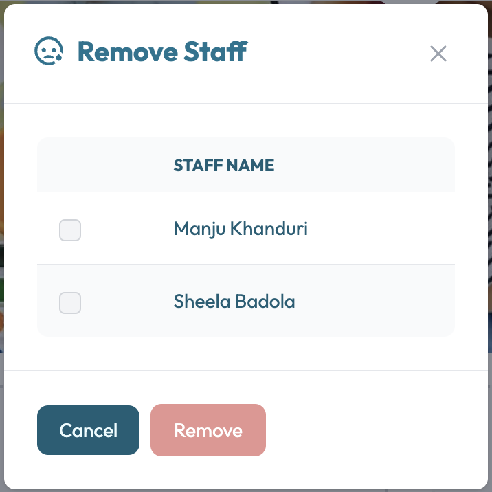

# Remove Staff
The remove staff form is used to remove a staff member from the website. The form contains of a list of the existing staff members and a button to remove the selected staff member.

## Staff List
A list of staff members is displayed in a table format. Each staff member can be identified by their name.
In order to remove a staff member, you need to select the staff member from the list and click on the "Remove" button.

