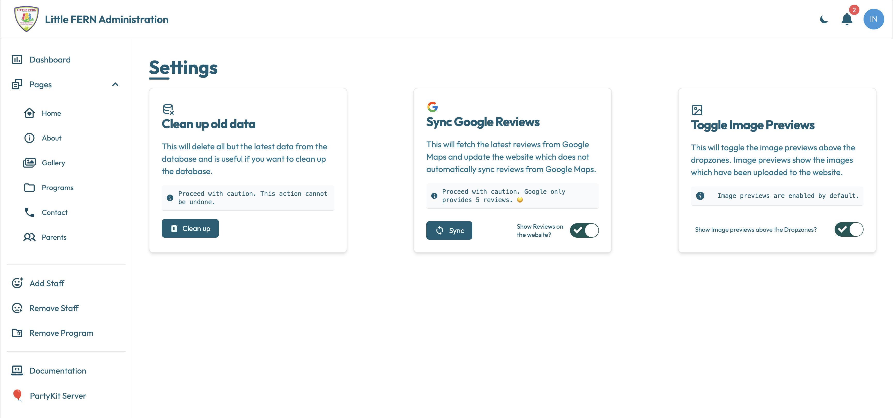

# Settings
The settings page allows the user to:
- Clean up old data from the database.
- Sync Google Reviews from Google to the database and update the website.
- Show/Hide image previews in the web app above the dropzones.

**NOTE**: These actions are irreversible and should be performed with caution. If you're unsure better to ask for help from [👨🏽Rohit](mailto:rohit.khanduri@proton.me)

## Clean Up Old Data
The Cleanup Old Data section allows the user to delete old data from the database. 
The user will delete all but the latest data from the database by clicking on the **Clean up** button. This action is irreversible and should be 
performed with caution.

## Sync Google Reviews
The Sync Google Reviews section allows the user to sync Google Reviews from Google to the database and update the website.
The user will sync the latest Google Reviews by clicking on the **Sync** button. This action is irreversible and should be performed with caution.
Unfortunately, the Google Reviews API only returns the latest 5 reviews which means that only the latest 5 reviews will be synced to the database 
and displayed on the website.

Clicking on the **Sync** button will fetch the latest 5 Google Reviews and update the website with the new reviews.
The toggle switch (Show Reviews on the website) allows the user to show/hide the Google Reviews on the website.

## Toggle Image Previews
The Toggle Image Previews section allows the user to show/hide image previews in the web app above the dropzones.
Because the content of each page editor is too large, the image previews can slow down the web app and force the user to scroll a lot.
The user can show/hide the image previews by clicking on the **Show image previews above the dropzones** toggle switch.

**NOTE**: If you're unsure about any of the actions, refrain from doing anything on this page and contact [👨🏽Rohit](mailto:rohit.khanduri@proton.me)
